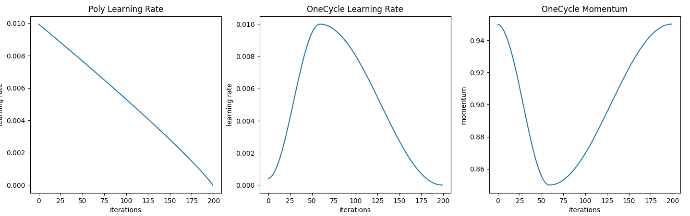
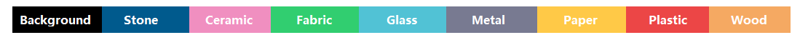

# Pytorch-Material-Based-Semantic-Segmentation

## Introduction
Semantic image segmentation is the ability of the machine to understand the semantic meaning of every pixel in the image. The previous research has focused mainly on segmenting objects in general context such as humans, animals, cars, ... (e.g. **Pascal-VOC2012** dataset)<br>

The segmentation of an indoor environment based on material textures is a state-of-the-art of many recent researches since its complexity such as **MINC** solution. In fact, due to many problems in this specific context, like similarity between materials' appearance, images are sometimes insufficient to differentiate them especially when they are painted in real life. The resemblance sometimes gives a need to use additional information such as the stiffness of the material by using other components such as haptic sensors.<br>

However, we have proved in this work that semantic segmentation of materials can be done using information from images only through deep learning.
The first tests showed promising results using the **DeeplabV3+** architecture with different backbones like **Resnet** 18, 34, 50, 101, 152 and **Xception** and also **PSPNet**. The work is still in progress and the results achieved can be optimized and much more improved.

## Project Context : 
Graduation internship at the Hydrogen Research Institute (University of Quebec)

## The main tasks completed in 6 months : 

- Research in the recent and the most relevant Deep Learning and Semantic Segmentation papers and reviews.
- Data gathering
- Annotation and preparation of our custom dataset.
- Model training and testing using an Amazon Sagemaker notebook instance.
- Comparing the chosen models performance (DeepLabV3+, PSPNet, U-Net, SegNet, FCN, GCN, UperNet) in our custom use case using different model backbones (ResNet-18, ResNet-34, ResNet-50, ResNet-101, ResNet-152, Xception).
- Improving the best result with more data using the data scraping techniques and an automatic annotation algorithm using OpenCV.
- Integration of our solution in the ROS/Gazebo simulation environment of the Hydrogen Research Institute's disinfectant robot.

📍 𝐊𝐞𝐲𝐰𝐨𝐫𝐝𝐬 : Deep Learning, Semantic Segmentation, Material Textures, Cloud Computing (AWS SageMaker), ROS/Gazebo (Robotics), Data Preparation, DeepLabV3+, PSPNet, SegNet, U-Net, ResNet, Xception

📓 **Paper** : <a href="./documentation/Report - French Version/Rapport du Projet de fin d'études - Ghassene TANABENE.pdf"> Report.pdf</a> or <a href="https://drive.google.com/file/d/19wjBXv4n0BilmPU7iLahStYc5Wv9sSnQ/view?usp=sharing">Link</a>.

📓 <b>Presentation</b> : <a href="./documentation/Présentation Finale PFE.pdf"> Presentation.pdf</a> or <a href="https://drive.google.com/file/d/11_VYwIZ1BthUMKiiPY8k4HI_LArE8vhZ/view?usp=sharing">Link</a>.
<hr>

## Table of contents
- Data 
- Training
- Inference
- Code Structure
- References

## Author 
- **Ghassene TANABENE** : ghassene.tanabene@gmail.com | <a href="https://www.linkedin.com/in/ghassene-tanabene/">Linkedin</a>
<hr>

## 📍 Requirements

```shell
!pip install -r requirements.txt
```

## 📍 [](README.md#sectiondata) Data

### Data Gathering :

Our custom data is collected from various resources : <br>
- From the indoor environment of the Hydrogen Research Institute <a href="https://www.irh.ca/fr/">(IRH)</a> <br>
- From <a href="https://flickr.com/">flickr</a> <br>
- From <a href="http://opensurfaces.cs.cornell.edu/shapes/substance/all/">open surfaces</a> <br>
- From the patch classification dataset <a href="http://opensurfaces.cs.cornell.edu/publications/minc/">MINC-2500 </a> and the <a href="http://opensurfaces.cs.cornell.edu/publications/minc/"> 7061 labeled material segmentations images</a> in 23 material categories (Not used in the first trainings) <br>

### Data Annotation :

The first step for data preparation is the pixel-wise labeling of the gathered images. In this work, we used polygonal annotations to delineate the boundaries of the material textures. There are many online annotation tools : <br>
- <a href="https://cvat.org/">CVAT</a> <br>
- <a href="https://app.hasty.ai/">hasty.ai <br>
- <a href="https://segments.ai/">segments.ai</a> <br>
- <a href="https://app.superannotate.com/">Super Annotate</a> <br>
We used <a href="https://cvat.org/">CVAT</a> as shown below : 

  ....
### Dataset : 
  #### HRIM2021 (Hydrogen Research Institute Materials 2021)

The dataset in semantic segmentation task is composed of two parts : <br>
- **JPEG Images** : This folder contains the original images (JPEG). <br>
- **Segmentation Class** : This folder contains the pixel-level annotations (masks in PNG format). <br>

The original image and the corresponding mask should have the same name. (Image : Image_ID.jpeg , Mask : Image_ID.png) <br>
  
  #### Dataset Structure

  Before the training, download HRIM2021 dataset that should be in this structure : 
  ```
HRIM2021/
│
├── JPEGImages - original images
│   ├── 000000.jpg
│   ├── 000001.jpg
│   ├── 000002.jpg
│   └── *.jpg
│ 
├── SegmentationClass - png masks
│   ├── 000000.png
│   ├── 000001.png
│   ├── 000002.png
│   └── *.png
│
├── JPEGImagesAug - the augmented images 
│
├── SegmentationClassAug - the augmented masks
│ 
├── ImageSets 
│   ├── Segmentation
│       ├── train.txt
│       ├── val.txt
│       ├── test.txt
│       └── trainval.txt
└──
  ```  
  
## Data Quality Improvement
To achieve a good result, we need to improve the quality of the data. For this reason, we use augmention for images and masks to avoid overfitting, and data balancing.
### Data augmentation :

Data augmentation in data analysis are techniques used to increase the amount of data by adding slightly modified copies of already existing data or newly created synthetic data from existing data. It acts as a regularizer and helps reduce overfitting when training a machine learning model.<br>
  We used <a href="https://github.com/albumentations-team/albumentations">Albumentations</a>, the python library for image augmentation. <br>
  
  - [x] Affine transformations (Spatial-level transformations)
    - Rotation
    - Scaling
    - Random cropping
    - Reflection ...
  - [x] Pixel-level transformations
    - Contrast shift
    - Brightness shift
    - Blurring
    - Channel shuffle ... 
  - [ ] Advanced transformations
    - Random erasing
    - Adding rain effects, sun flare...
    - Image blending
  - [ ] Neural-based transformations
    - Adversarial noise
    - Neural Style Transfer
    - Generative Adversarial Networks (GANs)
    - Style GANs ...  

To prepare augmented data, we can simply run:
  
  ```shell
!python ./utils/data_augmentation.py  --JPEGImages path_to_images_folder  --SegmentationClass path_to_png_masks_folder  --output output_folder
```
This augmentation is done before starting the training step. If we want to make it implicitly after loading data, we can use the functions defined in ```./base/base_dataset.py```.

 ### Data Scraping : 
  
  The first trainings are done with an ambalanced dataset. For this reason, we are working on improving the data quality by creating some synthetic data. We tried scrape images  from <a href="https://opensurfaces.cs.cornell.edu/shapes/substance/all/">opensurfaces</a> and automatically generate masks with openCV python library.
This step is implemented to be used on google colab where images will be automatically saved on google drive.
  #### Image Scraping
  We used beautifulsoup library to scrape images links and selenium library to scroll down the web pages. To simplify this task, we conseder only the images containing a single material on the foreground and having a white background.   
```shell
!apt-get update
!apt install chromium-chromedriver
!cp /usr/lib/chromium-browser/chromedriver /usr/bin
!pip install selenium
```  
  
  
  We can do the scraping with this command : 
  ```shell
  !python ./utils/data_scraping_v2.py --config path_to_scraping_config.json --output output_folder
  ``` 
  Exemple of a scraping congiguration for fabric, metal and glass from opensurfaces.
  ```json
{
    "Fabric":

    {
    "url": "http://opensurfaces.cs.cornell.edu/shapes/substance/all/29/",
    "tag_img_container": "svg",
    "tag_img_container_class" : "fix-aspect",
    "tag_image" : "image",
    "var_tag_image" : "xlink:href"
    },

    "Metal":

    {
    "url": "http://opensurfaces.cs.cornell.edu/shapes/substance/all/10/",
    "tag_img_container": "svg",
    "tag_img_container_class" : "fix-aspect",
    "tag_image" : "image",
    "var_tag_image" : "xlink:href"
    },

    "Glass":

    {
    "url": "http://opensurfaces.cs.cornell.edu/shapes/substance/all/6/",
    "tag_img_container": "svg",
    "tag_img_container_class" : "fix-aspect",
    "tag_image" : "image",
    "var_tag_image" : "xlink:href"
    }
  }
  ``` 
  #### Synthetic masks
  you can annotate the scraped images using this command : 
  ```shell
  !python ./utils/synthetic_mask.py --segClass MateriaClass --images DataScraping/MateriaClass/JPEGMateriaClass --output DataScraping/material_class/maskMaterialClass
  ```

  
## 📍 Training :
  
  ### Models :
  - **(Deeplab V3+)** Encoder-Decoder with Atrous Separable Convolution for Semantic Image Segmentation [<a href="https://arxiv.org/abs/1802.02611">Paper</a>] <br>
  - **(GCN)** Large Kernel Matter, Improve Semantic Segmentation by Global Convolutional Network [<a href="https://arxiv.org/abs/1703.02719">Paper</a>] <br>
  - **(UperNet)** Unified Perceptual Parsing for Scene Understanding [<a href="https://arxiv.org/abs/1807.10221">Paper</a>] <br>
  - **(DUC, HDC)** Understanding Convolution for Semantic Segmentation [<a href="https://arxiv.org/abs/1702.08502">Paper</a>] <br>
  - **(PSPNet)** Pyramid Scene Parsing Network [<a href="http://jiaya.me/papers/PSPNet_cvpr17.pdf">Paper</a>] <br>
  - **(ENet)** A Deep Neural Network Architecture for Real-Time Semantic Segmentation [<a href="https://arxiv.org/abs/1606.02147">Paper</a>] <br>
  - **(U-Net)** Convolutional Networks for Biomedical Image Segmentation (2015): [<a href="https://arxiv.org/abs/1505.04597">Paper</a>] <br>
  - **(SegNet)** A Deep ConvolutionalEncoder-Decoder Architecture for ImageSegmentation (2016): [<a href="https://arxiv.org/pdf/1511.00561">Paper</a>]<br>
  - **(FCN)** Fully Convolutional Networks for Semantic Segmentation (2015): [<a href="https://people.eecs.berkeley.edu/~jonlong/long_shelhamer_fcn.pdf">Paper</a>] <br>
  
  To train our model, we should choose first the architecture to use. Then just run this simple command : 
  ```shell
  !python train.py  --config path_to_config.json
  ```
  The training will automatically be run on the GPUs (if more that one is detected and multipple GPUs were selected in the config file, torch.nn.DataParalled is used for multi-gpu training), if not the CPU is used.
  ### Fine Tuning 
  
  We can fine tune the hyperparameters in the config file. This is an example of Deeplabv3+ config with Resnet101 as a model backbone.
```json  
  {
    "name": "DeepLab",
    "n_gpu": 1,
    "use_synch_bn": false,

    "arch": {
        "type": "DeepLab",
        "args": {
            "backbone": "resnet101",
            "freeze_bn": false,
            "freeze_backbone": false
        }
    },

    "train_loader": {
        "type": "HRIM",
        "args":{
            "data_dir": "HRIM2021",
            "batch_size": 8,
            "base_size": 400,
            "crop_size": 513,
            "augment": true,
            "shuffle": true,
            "scale": true,
            "flip": false,
            "rotate": false,
            "blur": false,
            "split": "train",
            "num_workers": 8
        }
    },

    "val_loader": {
        "type": "HRIM",
        "args":{
            "data_dir": "HRIM2021",
            "batch_size": 8,
            "crop_size": 513,
            "val": true,
            "split": "val",
            "num_workers": 4
        }
    },

    "optimizer": {
        "type": "SGD",
        "differential_lr": true,
        "args":{
            "lr": 0.01,
            "weight_decay": 1e-4,
            "momentum": 0.9
        }
    },

    "loss": "CrossEntropyLoss2d",
    "ignore_index": -1,
    "lr_scheduler": {
        "type": "Poly",
        "args": {}
    },

    "trainer": {
        "epochs": 100,
        "save_dir": "saved/",
        "save_period": 20,
  
        "monitor": "max Mean_IoU",
        "early_stop": 80,
        
        "tensorboard": true,
        "log_dir": "saved/runs",
        "log_per_iter": 20,

        "val": true,
        "val_per_epochs": 10
    }
}
```   
  ### Losses
  - **Cross Entropy loss**
  - **Dice-Loss**, which measures of overlap between two samples and can be more reflective of the training objective (maximizing the mIoU), but is highly non-convexe and can be  hard to optimize.
  - **CE Dice loss**, the sum of the Dice loss and CE, CE gives smooth optimization while Dice loss is a good indicator of the quality of the segmentation results.
  - **Focal Loss**, an alternative version of the CE, used to avoid class imbalance where the confident predictions are scaled down.
  - **Lovasz Softmax** lends it self as a good alternative to the Dice loss, where we can directly optimization for the mean intersection-over-union based on the convex Lovász extension of submodular losses (for more details, check the paper: The Lovász-Softmax loss).
  
  ### Learning rate
  - **Poly learning rate**, where the learning rate is scaled down linearly from the starting value down to zero during training. Considered as the go to scheduler for semantic segmentaion (see Figure below).
  - **One Cycle learning rate**, for a learning rate LR, we start from LR / 10 up to LR for 30% of the training time, and we scale down to LR / 25 for remaining time, the scaling is done in a cos annealing fashion (see Figure bellow), the momentum is also modified but in the opposite manner starting from 0.95 down to 0.85 and up to 0.95, for more detail see the paper: <a href="https://arxiv.org/pdf/1708.07120.pdf">Super-Convergence</a>.
 </img>
  ### Visualizations 
  The log files will be saved in saved\runs and the .pth checkpoints in saved\, to monitor the training using tensorboard, please run:
  
   ```shell
!tensorboard --logdir saved

  ```

## 📍 Inference
  
  ### Palette 
  In this work, we are using only 8 material classes that are the most widespread in indoor environments since the preparation of more specific categories is very time consuming. Considering the time limitation, we regrouped some specific types of materials to general classes ( e.g. : leather belongs to fabric class), and we adopt this palette to describe the segmentation classes :

  
  
 The RGB color codes are written in this file : ```./utils/palette.py```
  
  ### Test 
  For inference, we need a PyTorch trained model ```./saved/model/checkpoint.pth```, the images we would like to segment and the same configuration used in the training  ```./saved/model/date/config.json```. Then we run this line command : 
```shell
  !python inference.py --config path_to_config.json --model path_to_model.pth --images images_folder --output output_folder
  ```
  We can change the mode of inference : 
  ```shell
  --mode         Mode to be used, choose either `multiscale` or `sliding` for inference (multiscale is the default behaviour).
  ```
 ### Results
 The training and result details are explained in the <a href="https://drive.google.com/file/d/19wjBXv4n0BilmPU7iLahStYc5Wv9sSnQ/view?usp=sharing">paper</a>. We did 4 experimentations using different models and backbones.
 
 <h3> Experimentation 3 </h3>
 
 <h3> Experimentation 4 </h3>
 
 
 
 This is a short test on the real indoor environment of the Hydrogen Research Institute with a trained **DeepLabV3+** model using **ResNet-101** as a backbone. The model is trained on our custom material dataset called "HRIM2021" achieving **83.2 % (Mean-IoU)** and **95.1 % (Mean Pixel Accuracy)**.

  <center></center>
  
  ## 📍 Code Structure :
  
  The code structure is based on <a href="https://github.com/victoresque/pytorch-template/blob/master/README.md">pytorch-template</a>.
  
```  
pytorch-template/
│   
├── HRIM2021  - our custom dataset
│
├── train.py - main script to start training
├── inference.py - inference using a trained model
├── trainer.py - the main trained
│   
├── configs
│   ├── config.json - holds configuration for training
│
├── base/ - abstract base classes
│   ├── base_data_loader.py
│   ├── base_model.py
│   ├── base_dataset.py - data augmentations are implemented here
│   └── base_trainer.py
│
├── dataloader/ - loading the data for different segmentation datasets
│   ├── hrim.py     - dataloader of our custom dataset HRIM2021
│   ├── label 
│       └── hrim.txt
│
├── models/ - contains the implementation of semantic segmentation models 
│
├── pretrained/ - contains pretrained backbone models
│
├── saved/
│   ├── model-Checkpoints/ - trained models are saved here
│   └── run/ - default logdir for tensorboard and logging output
│  
└── utils/ - small utility functions
    ├── losses.py - losses used in training the model
    ├── metrics.py - evaluation metrics used
    ├── lr_scheduler - learning rate schedulers 
    ├── palette.py - RGB color codes of the dataset 
    └── ...
```

<hr>

**Important** :

For confidentiality obligations, we cannot share the entire source code, our dataset and the models checkpoints. 

📅 **Last Update On** : September 2021.


✉️ **Contact :**

email : ghassene.tanabene@gmail.com

linkedin : https://www.linkedin.com/in/ghassene-tanabene/
